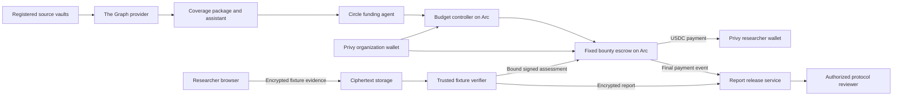

# Technical specification

Version: 1.0.0

## 1. Implementation baseline

Use a TypeScript monorepo with pnpm workspaces. Use React and Vite for the browser application. Use Fastify for the API. Use PostgreSQL with Drizzle migrations. Use PostgreSQL-backed durable jobs, such as pg-boss, for background work. Use Solidity, Foundry, and established OpenZeppelin contract libraries for settlement. Use viem for EVM reads and transaction encoding.

Use Graph Subgraphs as the first implementation of the standardized coverage package. Use one schema across deployments on supported source networks. A Substreams implementation is optional. It must not replace the live Graph provider requirement with a local stream.

Use a documented model API through a server-side adapter. Pin an approved model ID in configuration. Do not assume a particular subscription or account exists.

Resolve current stable, mutually compatible package versions during scaffolding. Commit the lockfile. Record the Node, pnpm, Foundry, compiler, Graph CLI, and SDK versions in `docs/IMPLEMENTATION_STATUS.md`. This specification deliberately does not invent future package versions.

## 2. Repository layout

```text
apps/web/                         React application
services/api/                     Authentication, authorization, API, transaction intents
services/worker/                  Chain reconciliation, Graph sync, coverage jobs
services/verifier/                Isolated trusted fixture verifier
services/report-release/          Report access after final payment
packages/domain/                  Shared types, schemas, amounts, state transitions
packages/contracts-client/        Generated ABIs and chain clients
packages/coverage-data/           Graph schema, mappings, manifests, reusable queries
packages/coverage-agent/          Recommendations and approved funding selection
packages/provider-adapters/       Privy, Circle, Graph, model, storage interfaces
packages/crypto-envelope/         Library wrappers and canonical hashing
contracts/src/                    Escrow, budget controller, safe source fixtures
contracts/test/                   Unit, invariant, and integration tests
tests/e2e/                        Browser journeys
tests/integration/                API, worker, and provider integration tests
infra/                            Local containers and deployment manifests
scripts/                          Setup, preflight, seed, evidence, reconciliation
docs/                             Specifications and generated operational records
evidence/                         Sanitized test and sponsor evidence
```

Do not create an exploit runner, arbitrary calldata interpreter, general contract scanner, or third-party target execution module.

## 3. Architecture



The API is a control plane. It does not decide whether a payment happened. The chain is authoritative for financial state. PostgreSQL stores application records and projections. Graph data is authoritative only for the public data it actually indexes. It is not a cryptographic proof of a vault’s complete execution state.

## 4. Environments and network configuration

Support `local` and `arc-testnet`. Keep separate provider accounts, keys, database namespaces, contract addresses, and storage buckets. There is no implicit mainnet mode.

Initial Arc testnet reference values are chain ID `5042002`, RPC `https://rpc.testnet.arc.io`, and explorer `https://testnet.arcscan.app`. Revalidate before deployment. See [Arc network configuration](https://docs.arc.io/arc/references/connect-to-arc).

Use the USDC ERC-20 interface for application balances and transfers. The documented interface address is `0x3600000000000000000000000000000000000000`. The ERC-20 interface uses 6 decimals. Native gas accounting uses 18 decimals. Both interfaces represent the same underlying balance. Do not add the two balances together. Keep gas reserves in the sending wallet. See [Arc token addresses](https://docs.arc.io/arc/references/contract-addresses) and [Arc stablecoin model](https://docs.arc.io/arc/concepts/stablecoin-native-model).

Verify the configured token through documented chain behavior, `decimals()`, a balance read, and a small test transfer. A system contract can have different code-discovery behavior from an ordinary deployed token. Do not reject an official system interface solely because a generic bytecode check fails.

Use a local six-decimal test token for unit tests. Label it `TEST_USDC`. It is not sponsor evidence.

Store all token quantities as base-unit integers. Serialize them as decimal strings. Use bigint in application code and uint256 in contracts. Never use floating point for balances, fees, credits, or limits.

## 5. Identity and authorization

Validate Privy authentication on the server. Derive the user ID from the verified token. Never trust a request body’s user ID. Confirm wallet ownership with the provider and store the chain-qualified address.

Use these organization roles:

| Role | Allowed actions |
| --- | --- |
| `OWNER` | Manage members, configure wallet controls, approve policies, allocate budgets |
| `TREASURY` | Prepare funding, execute permitted funding, view financial records |
| `REVIEWER` | Review program terms and access paid reports |
| `VIEWER` | Read organization program and receipt data; no private reports |

A researcher is an application user with claims. Organization membership does not grant access to another researcher’s evidence. A user can have both roles, but each request must use the applicable organization and claim scope.

Use server-side membership checks for every resource request. Keep report authorization in the report service as well. Require a fresh authorization check for member removal, wallet change, and report access. Protect cookie-based mutations against cross-site request forgery. Use short-lived, audience-bound service tokens between services.

Wallet control is distinct from application role control. At least one real Privy policy must enforce a meaningful funding restriction. An API-only permission check does not satisfy that requirement.

## 6. Financial model

Version 1 charges no product fee. One bounty contains one reward. There is no yield and no credit expiry. A program can contain many bounties.

Keep three financial locations separate:

1. The organization’s Privy wallet holds uncommitted funds.
2. Its budget controller holds a limited amount for approved future bounties.
3. The escrow holds funds committed to existing bounties or claimant credits.

Do not treat a claimant’s credit as an available organization balance. Do not let the agent reuse funds from an existing bounty.

For each bounty:

```text
remaining liability = unallocated reward + claimant credit
contract token balance >= sum of all remaining liabilities
```

Qualification moves the fixed reward from unallocated reward to claimant credit. Payment reduces the credit and transfers the same amount. Refund reduces only unallocated reward after the policy’s settlement deadline. Unsolicited token transfers are surplus. Version 1 has no surplus withdrawal function.

## 7. Policy and identifiers

Deploy a non-upgradeable `BountyEscrow` for version 1. Avoid a proxy and administrator functions that can rewrite existing policy or withdraw credited funds.

Define `BountyPolicyV1` with the following fields in this exact order for ABI encoding:

```text
uint256 settlementChainId
address escrow
bytes32 organizationId
address refundRecipient
uint256 sourceChainId
address sourceVault
bytes32 sourceBlockHash
bytes32 fixtureManifestRoot
bytes32 adapterId
bytes32 adapterCodeHash
bytes32 verifierConfigHash
address admissionSigner
address verdictSigner
bytes32 reportRecipientKeyId
address asset
uint256 reward
uint256 minimumDiscrepancy
uint64 submissionDeadline
uint64 settlementDeadline
uint32 reservationDurationSeconds
bytes32 organizationNonce
```

`policyHash = keccak256(abi.encode(POLICY_TYPEHASH, all fields in order))`. Publish cross-language test vectors. `POLICY_TYPEHASH` is the keccak256 hash of the exact canonical Solidity type declaration. Use the same domain conventions in all clients.

`bountyId = policyHash`. A duplicate policy hash cannot create a second bounty. Use a new organization nonce for a new bounty. All policy fields become immutable when funding succeeds.

The policy fixes one report recipient key ID. Changing organization keys requires a new bounty. Preserve old keys for paid-report access under the retention policy.

The source vault and block identify the public context. The fixture root authenticates the synthetic evidence. It does not prove that the fixture describes an actual condition in that source vault. Expose `evidenceScope = FIXTURE_ONLY` everywhere a verdict is displayed.

## 8. Escrow interface

Implement these operations. Exact Solidity naming must match the generated ABI and API transaction builders.

| Operation | Caller | Required behavior |
| --- | --- | --- |
| `createAndFund(policy)` | Funding wallet or budget controller | Validate policy and transfer exactly `reward` into escrow atomically |
| `reserveClaim(admission, signature)` | Any relayer | Verify the admission signer and create one active reservation |
| `submitAssessment(assessment, signature)` | Any relayer | Verify the bound assessment and accept qualification or rejection |
| `expireReservation(bountyId)` | Anyone | Close an elapsed reservation without creating credit |
| `collectPayment(bountyId)` | Anyone | Transfer credit to the already bound claimant address |
| `refundExpired(bountyId)` | Anyone | Return only unallocated reward to the immutable refund recipient after cutoff |
| `getBounty(bountyId)` | Anyone | Return policy hash, status, amounts, and current reservation |

Use safe token transfer helpers, explicit validation, checks-effects-interactions, and reentrancy protection around state-changing transfer paths. A failed transfer must revert its state change. Validate token receipt by balance delta on funding. Support the configured USDC interface only. Reject fee-on-transfer and rebasing assets.

Require `settlementChainId == block.chainid`, `escrow == address(this)`, nonzero signers and recipients, a positive reward and discrepancy threshold, and `submissionDeadline < settlementDeadline`. Require reservation duration between 60 seconds and 1800 seconds. Require the settlement window to extend at least one reservation duration beyond the submission deadline.

### 8.1 Reservation

Use EIP-712 typed authorization with domain name `VulnProof`, version `1`, current chain ID, and this escrow address. Use an `AdmissionV1` type distinct from the assessment type.

Admission contains `bountyId`, `claimId`, `claimant`, `evidenceCommitment`, `authorizationNonce`, and `validUntil`. `claimId` is a random 32-byte identifier. The admission service creates it after an encrypted upload passes size and format checks. The claimant address must belong to the authenticated researcher.

The contract rejects a used nonce, expired authorization, non-funded bounty, active reservation, or admission after the submission deadline. The reservation expires at `min(block.timestamp + reservationDurationSeconds, settlementDeadline)`.

A queued request does not reserve funds. The service must not sign overlapping admission authorizations for a bounty. Contract checks remain authoritative if services race. Use a five-minute admission validity and a 30-minute reservation by default.

The admission service applies one pending claim per user per bounty, a per-user rate limit, and a queue limit. It can deny new service admissions during an incident. It cannot erase a credit or change a funded policy. This trusted admission model can delay service and must appear in the trust record.

### 8.2 Assessment

Use an `AssessmentV1` EIP-712 structure:

```text
bytes32 bountyId
bytes32 policyHash
bytes32 claimId
address claimant
bytes32 evidenceCommitment
bytes32 caseNullifier
bytes32 reportHash
bytes32 adapterCodeHash
bytes32 verifierConfigHash
uint8 outcome
uint256 reward
uint64 assessedAt
uint64 validUntil
```

`outcome` is `1` for `QUALIFIES` and `2` for `DOES_NOT_QUALIFY`. Infrastructure failures have no onchain outcome and cannot produce a rejection signature.

Verify all bound values against the policy and active reservation. Require `assessedAt <= block.timestamp`, `validUntil >= block.timestamp`, and `block.timestamp <= reservation.expiresAt`. Cap validity at the reservation expiry. Validate the signature with a reviewed ECDSA implementation that rejects malleable signatures.

For `QUALIFIES`, require `reward == policy.reward`, nonzero `reportHash`, and a previously unused case nullifier within this bounty. Move the reward to the claimant’s credit. Finish the bounty’s admission lifecycle. Only one claim can qualify.

For `DOES_NOT_QUALIFY`, require `reward == 0`. Close the reservation. Keep the reward available for another reservation until the submission deadline. A rejected case nullifier remains recorded for service deduplication but must not prevent a different fixture case from being submitted.

The case nullifier is `keccak256(abi.encode(bountyId, fixtureLeafHash))`. It addresses exact fixture-case repeats. It is not a general duplicate-vulnerability detector.

### 8.3 Collection and refund

After qualification, `collectPayment` sends the credit to the claimant address fixed by the reservation and assessment. A relayer cannot replace that address. Collection must remain possible after all policy deadlines. A second collection has no transfer and returns a clear already-collected error.

`refundExpired` is valid only after `settlementDeadline`, when no claimant credit exists and the bounty has not paid. Expire any elapsed reservation first. Transfer only that bounty’s unallocated reward. Caller identity does not change the refund destination.

The reference worker scans final expiry and refund events before a new recovery send. Save each completed scan page with its final block hash. Resume from that checkpoint after a restart. Use at most five pages of 2000 blocks per check. Save the exact Circle request before sending it. Preserve the provider key while a response is uncertain. A final reverted receipt permits a new attempt, with a maximum of five failed transactions per action. Stop an unresolved request with an unknown hash after 23 hours. See [retention and recovery](RETENTION_AND_RECOVERY.md) for status and retry rules.

There is no global pause for credit collection. A service incident can stop new admissions or new budget allocations. If a verdict key is compromised, the immutable existing policies retain that risk. Do not imply that an administrator can safely replace the signer for existing bounties. Use small testnet values in this release.

## 9. State model

Keep chain state, job state, and report state separate. Avoid one overloaded status column.

```text
Bounty chain state:
FUNDED -> RESERVED -> QUALIFIED -> PAID
             |            
             +-> FUNDED   (rejected or expired reservation)
FUNDED or expired RESERVED -> REFUNDED (after settlement deadline)

Claim job state:
UPLOADING -> UPLOADED -> ADMISSION_PENDING -> RESERVING -> RESERVED
RESERVED -> VERIFYING -> ASSESSED -> SETTLEMENT_PENDING -> SETTLED
Any unfinished service step -> RETRY_WAIT or FAILED
An elapsed reservation -> EXPIRED

Report state:
NOT_CREATED -> ENCRYPTED_READY -> LOCKED -> RELEASE_ELIGIBLE -> AVAILABLE
Release operation failure -> RELEASE_RETRY
```

`QUALIFIED` means payment is available. `PAID` means a successful final payment event exists. `AVAILABLE` means the report service has authorized organization access. A failed report job never reverses a valid payment.

## 10. Controlled fixture verifier

Implement `ACCOUNTING_FIXTURE_V1`. It accepts a fixed JSON record with unsigned integer fields. It performs no user-supplied code execution and makes no user-selected network requests.

A fixture manifest contains a sorted-pair Merkle root of team-created case commitments. Use an established Merkle library and published test vectors. The manifest includes its version, team owner signature, source context, creation time, and the explicit `synthetic: true` label.

Each leaf is:

```text
keccak256(abi.encode(
  FIXTURE_LEAF_TYPEHASH,
  bytes32 caseId,
  uint256 expectedAssets,
  uint256 observedAssets,
  bytes32 salt
))
```

All quantities use the policy’s six-decimal unit for the demonstration. The case values are authored test data. They are not extracted loss measurements from a deployed vault.

The private evidence contains the leaf fields, manifest version, and Merkle proof. The verifier checks membership in the policy’s fixture root, validates the exact schema, and computes `discrepancy = max(expectedAssets - observedAssets, 0)`. A record qualifies only if `discrepancy >= minimumDiscrepancy`.

Ship at least three cases: a qualifying discrepancy, a zero discrepancy control, and a below-threshold discrepancy. Generate salts using a cryptographic random generator. Publish sample synthetic fixture files only in the demo folder. Never present a fixture result as a real vault vulnerability.

The verifier must derive a structured report from the validated record. Include the case ID, comparison, policy, source-context label, outcome, fixture limitation, and next review action. Optional user notes remain separate and cannot affect the condition or payout.

Use canonical JSON with sorted keys and string-encoded integers. Define one canonicalization implementation in `packages/crypto-envelope`. Compute `reportHash = keccak256(canonicalReportBytes)` and create cross-language byte-level test vectors. Do not hash a rendered PDF or a JSON object with unspecified key order.

Before signing qualification, durably store the encrypted report and wrapped decryption key. Verify both can be read back. Bind the actual report hash into the assessment. A hash match alone is not the report validation step; constructing the report from the assessed record supplies that link in this fixed fixture model.

## 11. Privacy and key handling

### 11.1 Evidence upload

Use libsodium sealed boxes or an equivalent maintained high-level library for encryption to the verifier’s X25519 public key. Use a versioned envelope with `keyId`, `algorithm`, ciphertext hash, ciphertext length, and opaque upload ID. Do not write a custom cryptographic primitive.

Encrypt in the browser before upload. Restrict evidence to 256 KiB plaintext and the corresponding bounded ciphertext size. Accept JSON content only. Reject archives, scripts, transaction sequences, executable files, external URLs, and unknown schema fields.

The application API can issue a short-lived upload URL and read ciphertext metadata. Its service role cannot decrypt evidence. The verifier retrieves ciphertext by an internal object identifier, not an arbitrary URL supplied by a user.

### 11.2 Service trust

The baseline verifier runs as an isolated service with a distinct identity, private network access, and dedicated keys. Its operator remains trusted. Isolation is an application architecture property, not hardware attestation.

Keep the admission signing key, verdict signing key, evidence decryption key, and report key-wrapping keys separate. Store production-service keys in the approved secret manager. Development keys must be generated locally, ignored by version control, and rejected when the environment is `arc-testnet` unless explicitly marked testnet-only.

The API, model service, and coverage worker must not receive evidence decryption keys or report plaintext. Restrict verifier egress to configured storage, internal authentication, and configured read-only chain providers.

### 11.3 Reports

Generate a random authenticated-encryption key for each report. Encrypt the report with a maintained library. Wrap that key for the versioned report-release key registered to the organization. The release service stores organization private keys under the approved secret manager. The application operator is therefore trusted for this access-control promise.

Provide a separate researcher access path through the verifier’s authenticated report endpoint. It validates ownership and streams the researcher’s report directly. It must not make the organization release key available or grant early organization access. All responses use `Cache-Control: no-store`.

The organization path requires final `Paid` evidence plus current `OWNER` or `REVIEWER` membership. Recheck membership on every download. Do not put long-lived plaintext download URLs in emails, logs, or browser history. Prefer an authenticated streaming endpoint over a public object URL.

### 11.4 Retention

For the testnet reference service, delete abandoned ciphertext after 24 hours. Delete rejected and expired evidence after seven days. Keep paid encrypted reports for 30 days, with a visible export and deletion date. Keep non-sensitive financial receipts and report hashes. Document backup expiry so deletion claims include backups. These are product defaults, not legal retention advice.

Start the paid-report clock at the first successful release. A retry must preserve that deadline. Hold a qualifying report while settlement is unresolved. Do not delete it from an inferred local payment state. Delete paid evidence seven days after settlement once release has resolved. The reference implementation can also clear a hold through a matching final `ReservationExpired` receipt. Keep the report for seven days after its first expiry reconciliation. Preserve its expiry event reference and deletion date on retry. The organization must not gain report access through an expiry or refund.

Run cleanup in a separate service with access to ciphertext storage and the database. It needs no wallet or decryption key. Coordinate writes and cleanup with the shared maintenance lock. Record deletion before removing files, then retain the completed deletion record. Expired or deleted reports must remain inaccessible after an object restore. See [retention and recovery](RETENTION_AND_RECOVERY.md) for the implemented periods and recovery limits.

## 12. The Graph integration

Create `erc4626-coverage-data` as a reusable package. Define standardized `Vault`, `VaultObservation`, `VaultFlow`, and `SourceCursor` entities. Index ERC-4626 deposit and withdrawal events and capture available vault metadata through safe read calls. Store observation block numbers and failed-read indicators.

Use one query shape across at least three vault deployments. Include two distinct vault implementations when available. At least one live, existing deployment must supply public read-only context. Team-owned safe vault fixtures may supply the other deployments on a supported testnet. Clearly label source networks and synthetic data. Verify provider support before selecting deployments.

An event observation is not the current balance forever. Store `observedAtBlock` separately from `indexedHeadBlock`. A recent indexed head does not make an old observation current. If current metrics are required, use a documented, bounded block-handler observation schedule supported by the provider. Record unavailable metrics as null rather than zero.

The application joins live Graph vault data with confirmed Arc bounty coverage in PostgreSQL. Call this output `CoverageRecord`. Publish the join methodology and a reusable query client. Do not claim Arc settlement is Graph-indexed unless it actually is.

Every normalized record includes source chain, vault, provider deployment ID, query time, observed block/hash where supported, indexed head, schema version, and freshness state. Read-only source data never authorizes an escrow payment.

## 13. Coverage assistant and Circle funding agent

Separate the recommendation engine from the language model and transaction executor.

The deterministic engine compares registered vaults with confirmed active bounties and organization coverage policy. Version 1 supports missing coverage and fixed minimum funded-reward requirements. Asset-based ratios are allowed only for explicitly supported same-unit assets. Do not add cross-asset amounts or invent USD prices.

The language model explains the engine’s result using an allowlisted set of source records. It can ask for missing input and present approved actions. It cannot change policy hashes, choose new recipients, sign transactions, access claim evidence, or set a payout.

Each recommendation includes source IDs, source times, deterministic calculation, policy version, requested action, and an abstention reason when data is stale or incomplete. Treat all retrieved text as data. Never follow instructions embedded in token names, vault metadata, or external descriptions.

The Circle executor takes a structured action from the deterministic policy engine. It rechecks data freshness, budget, exact approved policy hash, deadline, chain, and target contract before sending. Give the executor no general shell or arbitrary transaction tool. Use a documented Circle Agent Stack wallet interface for the approved contract call. See [Circle Agent Stack](https://developers.circle.com/agent-stack).

Use defaults of a 300-second indexed-head freshness limit, a 300-second recommendation expiry, and a 60-second minimum allocation interval. Record these as organization configuration. Require a fresh user-approved policy if its fields change.

### 13.1 Budget controller

Deploy one non-upgradeable `FundingBudgetController` per organization. Bind its owner wallet, Circle operator address, asset, and escrow address. The owner can fund it, approve exact policy hashes, disable new allocations, change future spending limits, or recover unallocated controller funds.

Implement `approvePolicy(policyHash, reward, expiresAt)`, `setLimits(perActionLimit, dailyLimit, minimumInterval)`, `fundApprovedPolicy(policy)`, `setEnabled(bool)`, and `withdrawUnallocated(amount)`.

Only the Circle operator can allocate. It can allocate only an approved, unconsumed policy to the fixed escrow. Require `policy.refundRecipient == controller`, matching organization ID, supported asset, future submission deadline, approved reward, and all spending limits. Consume approval before the external call, with atomic rollback on failure.

Use a UTC day bucket `block.timestamp / 86400` for cumulative spending. Record allocated reward per bucket. A repeated call cannot exceed the daily limit by changing a request ID. Withdrawal and limit changes require the owner. Existing escrow liabilities remain untouched.

The UI must distinguish controller funds from the Circle wallet’s gas balance. Arc uses the same underlying USDC for token transfers and gas. A low gas balance must stop new actions with a clear recovery message.

### 13.2 Owner authorization and temporary wallet permissions

Require the requesting owner to sign each control request with a currently linked Privy wallet. Bind the organization, controller, owner wallet, command, request ID, actor, ten-minute expiry, and 0.05 test-USDC fee cap. Preserve these fields in the database. Recheck the current role and wallet link before a new signature and first broadcast.

Use one wallet lock for owner controls and direct bounty funding. Save the nonce and exact transaction before requesting a provider signature. Save signed bytes before broadcast. Restore the base Privy policy before broadcast. Reconcile a lost response with the saved transaction. Do not select another nonce for a retry.

The temporary Privy rule restricts Arc Testnet, zero native value, the destination, the function, and the expiry. It also fixes every argument for deposits, withdrawals, spending limits, and policy approval. Use argument names from the exact ABI. The token transfer ABI uses `recipient` and `amount`.

For `setEnabled(bool)`, Privy restricts the function but does not enforce the selected Boolean value in this integration. The application verifies that value through the signed owner message, immutable request, exact transaction bytes, and final event. Disclose this boundary in the confirmation message. Do not claim that Privy enforces the enabled state. The live checks reject the Boolean argument conditions tested during setup. They accept the function restriction and reject another destination.

Record temporary-policy cleanup before retrying an action. Cleanup must still run if the owner loses membership. If cleanup fails, keep the request pending and stop broadcast. If a signature or transaction is unresolved after authorization expiry, require reconciliation before another wallet action. Never delete its nonce reservation to clear the queue.

Require a canonical finalized receipt with the exact controller event. Deposits require the exact token transfer. Withdrawals require both the controller event and the transfer to its fixed owner. Only then record a final financial receipt.

## 14. Privy integration

Use Privy for real authentication and wallet operations. Store organization wallets separately from researcher wallets. Ensure the organization’s approval controls operate before funds become committed to a bounty. They must not provide a sponsor veto over claimant collection.

Configure a documented Privy policy to restrict an organization funding wallet to the approved chain and funding contracts. Demonstrate both an allowed action and a blocked action. Confirm the exact capabilities of the selected wallet path. Do not describe an application-only limit as Privy enforcement. See [Privy policies](https://docs.privy.io/controls/policies/overview).

The researcher flow must include receipt of USDC and a final outgoing transfer using a generally available Privy operation. Display the recipient, amount, network, and estimated fee before the user authorizes the transfer. Do not transfer a researcher’s funds automatically after receipt.

## 15. Chain reconciliation and finality

Persist transaction intent, provider request ID, sender, chain, transaction hash when known, and last observed status. Signing is not broadcasting. Broadcasting is not finality.

Use a chain-specific finality adapter. On Arc, verify documented finality and receipt behavior during preflight. Require a successful receipt and a canonical block observation consistent with that policy. On source Ethereum-compatible networks, use the configured finalized/safe policy. Do not invent a universal confirmation count.

Use a unique event key `(chainId, transactionHash, logIndex)`. Replay events from the last safe checkpoint on restart. Apply projections and outbox entries in one database transaction. Duplicate webhooks or events must not duplicate receipts or report jobs.

If a provider times out after accepting a transaction, reconcile the provider request and sender nonce before retrying. Never create a second payment because the first request timed out. Report release depends on the reconciled `Paid` event, not a webhook’s unverified claim.

## 16. Jobs and failure handling

Use durable jobs for upload verification, admission, reservation observation, assessment, assessment submission, payment observation, report release, coverage refresh, and receipt export. Give each job a stable deduplication key.

Use exponential backoff with jitter for transient provider errors. Default to five retries with a maximum five-minute delay. Stop verifier retries before the reservation expires. Dead-letter persistent failures and expose a recovery action. Distinguish validation errors, insufficient funds, expired state, provider outage, and internal failure.

Report release can retry after payment indefinitely within retention limits. Alert operators when payment is final but release remains delayed beyond five minutes. Do not contact users outside the application unless a separate notification feature is explicitly authorized.

## 17. Observability and deployment

Record request ID, job ID, provider, duration, error code, and public transaction reference. Use field allowlists for logs. Never log request bodies on evidence, report, authentication, wallet authorization, or model endpoints.

Deploy API, worker, verifier, and report release as separate containers. Keep PostgreSQL and storage private. Use TLS for external endpoints. Keep the verifier off the public internet except through authenticated internal routes. Run migrations as a separate release step. Use health checks that do not expose secrets.

Support database restore, object restore, key restore, and job replay in the runbook. Test recovery before claiming deployment readiness. Infrastructure manifests must describe an approved host; do not silently buy cloud resources.

## 18. Trust summary

| Component | Trusted for | Does not prove |
| --- | --- | --- |
| Graph provider | Correct delivery of indexed public observations | Full state authenticity or vulnerability |
| Privy | Wallet authorization and signing controls | Claim validity |
| Circle wallet service | Authorized operations-wallet transactions | Coverage recommendation correctness |
| Verifier operator | Fixture assessment, private handling, and truthful signature | Trustless or hardware-attested execution |
| Admission service | Fair service access and timely reservation authorization | Guaranteed access for every researcher |
| Report release operator | Withholding organization access until final payment | Cryptographic fair exchange against the operator |
| Arc and token implementation | Settlement execution and asset behavior | Offchain report availability |

Publish this table in the application’s technical details and submission documentation. Do not hide it behind a claim of universal proof.
