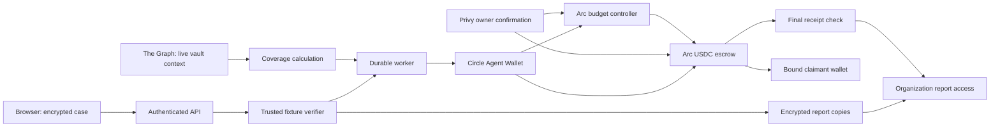

# Arc and Circle integration

Selected tracks: SP-03, SP-04, and SP-05. Track rules were checked on 8 September 2026. See [the sponsor page](https://ethglobal.com/events/ethonline2026/prizes/arc). This record does not certify prize eligibility.

## Problem and architecture

VulnProof binds a fixed reward to a signed synthetic accounting case. Arc holds the reward and records reservation, qualification, payment, and refund. An organization can read its report copy only after final payment.

This diagram shows the application boundaries. It does not prove hosted service isolation.

## SP-03: DeFi and on-chain finance

[Escrow deployment](escrow-deployment.json), [direct funding](bounty-funding.json), and [three-case settlement](claim-journey-0xa3147639ed3a03f68dab3f18cbb81d249c23ff6efb452f25b56c12ae8ba34a68.json) have live Arc receipts. The zero and below-threshold controls receive no reward. The qualifying case receives one test USDC. [Browser download evidence](paid-report-browser-downloads.json) checks the paid report hash.

[Automatic refund evidence](recovery-0xa26a9f3f8c56461e41ed35f85af089ef63617692a1e284abe60ad1953c813b87.json) verifies the return of 0.25 test USDC after a short bounty cutoff. It checks the exact inner Circle smart-account call and its successful operation event. No claim is submitted in this refund test.

The contract binds the claimant and refund recipient. Collection cannot replace the claimant. Qualification creates credit once. Payment and refund reduce the recorded liability. See [BountyEscrow.sol](../../contracts/src/BountyEscrow.sol), the contract tests, and `tests/claim-journey.test.ts`.

## SP-04: Agentic economy with Circle Agent Stack

[Live budget evidence](budget-allocation-9c60762d-cd1d-4fad-ace3-b45f971d9c6e.json) proves one approved Circle allocation. It records fresh Graph context, the immutable request, final controller and escrow events, and the exact USDC transfer. A second approved policy exceeds the daily limit. The worker creates no provider request. A read-only call confirms that the deployed controller rejects it.

The Circle CLI integration uses version 1.0.0 with a committed patch. It encodes tuple calls into `callData` and uses the saved UUID transaction intent as the provider request key. See `packages/circle`, `services/budget`, `services/worker`, and `patches/@circle-fin__cli@1.0.0.patch`. Local tests cover retries and concurrent jobs. The live model demonstration remains incomplete.

## SP-05: Launch and mainnet readiness

The working app currently runs locally against Arc Testnet. Chain ID: 5042002. Escrow: `0x01742711ee569a0186349e54cffe805209808292`. Controller: `0x999c73e9bb9f70013f7a20cddd97c9633b094dda`.

**Mainnet readiness is NOT READY.** The sponsor requires deployment or readiness by September 30. See [the readiness record](../../docs/MAINNET_READINESS.md). Hosted services, independent review, production configuration, and operational checks remain open. Testnet transactions do not complete this track.

## Run and inspect

1. Follow [the repository setup](../../README.md). Keep keys in the ignored local configuration.
2. Run `pnpm test:contracts` with Foundry v1.5.0.
3. Run `pnpm test:integration` with local PostgreSQL and Anvil.
4. Start the configured application with `pnpm dev`.
5. Inspect Fixture bounties, Organization, Private reports, and Receipts.

## Developer feedback and limits

The Circle tuple parser and execution request needed a version-specific patch. The saved request ID and exact event checks permit recovery without creating a second financial action.

Native USDC pays gas. ERC-20 USDC uses six decimals. They represent one asset balance and must not be added. The verifier is a trusted service. It handles synthetic fixtures only. Public source access, the video, staging restore, and separate live actor checks remain incomplete.
